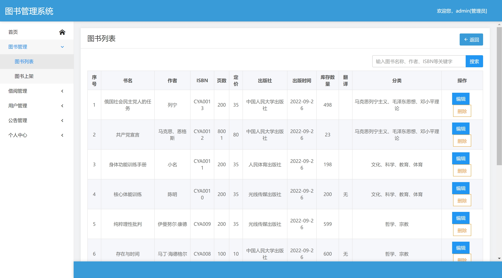

# springbootA045
springbootA045基于Java Springboot图书馆管理系统
 
## 查看主页获取源码

> **作者介绍**： **✌**全网粉丝10W+本平台特邀作者、博客专家、CSDN新星计划导师、java领域优质创作者,博客之星、掘金/华为云/阿里云/InfoQ等平台优质作者、专注于毕业项目实战 **✌**

  

### 一、作品包含

源码+数据库+文档+全套环境和工具资源+部署教程

### 二、项目技术

前端技术：Html、Css、Js

数据库：MySQL

后端技术：Java、Spring Boot、MyBatis

### 三、运行环境

开发工具：IDEA/eclipse

数据库：MySQL8.0

数据库管理工具：Navicat10以上版本

环境配置软件： JDK1.8+Maven3.6.3

### 四、项目介绍
项目编号：springbootA045

登录
后台主页
图书列表
图书上架
借阅图书
归还图书
用户列表
添加用户
公告列表
发布公告
个人信息详情
个人信息编辑

### 五、运行截图

